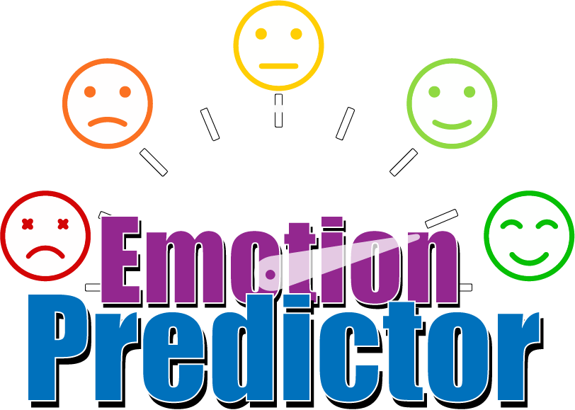
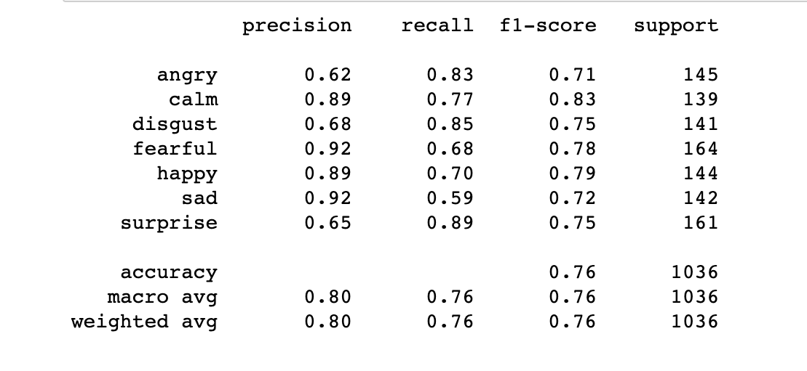
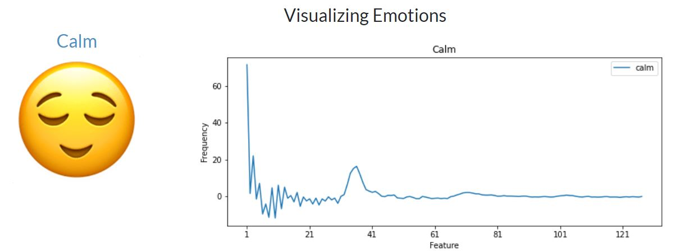

# Emotion Recognition- Machine Learning 

[Emotions Predictor ](https://voice-emotion.herokuapp.com)

## Table of contents
* [Emotion Predictor](#emotion-predictor)
* [Technologies](#technologies)
* [Objective](#objective)
* [ETL](#extract-transform-load)
* [Test & Train](#test-&-train)
* [Visualization](#visualiation)
* [Learnings](#learnings)
* [Run Flask App](run-flask)
* [Heroku](heroku)
* [Resources](#resources)
* [Contacts](#contacts)

## Emotion Predictor 

What is the Emotions Predictor?

Emotions Predictor is an application that allows users to record, and playback short audio file and its in-built super cool Machine Learning model will predict the range of emotions and the gender of the audio clip.
There are options to compare the frequencies and other attributes for various emotions to see how they show up on a scale.
Why Emotions Predictor? 
Empathy is important because it helps us understand how others are feeling so we can respond appropriately to the situation. Not all of us are born as manipulators, fortune-tellers or psychics with excellent empathetic skills. Also there are people who have certain disabilities understanding emotions or having below conditions like:
•	A person who has difficulty identifying and expressing emotions
•	People having trouble identifying social cues
•	People who are hard of hearing

Emotions predictor, can come in handy for Interpreting the emotions in the voicemails, FBI recordings, law disputes, alien interactions, etc.

Emotions include: 

* 02 = calm
* 03 = happy
* 04 = sad
* 05 = angry
* 06 = fearful
* 07 = disgust
* 08 = surprised

## Technologies

* Machine Learning
* Jupyter Notebook / Pandas 
* Javascript 
* Flask App
* D3
* HTML / CSS 
* Tableau 

## Extract Transform Load
*	Data from CSV files of audio voices. 
*	Used `librosa` package to convert audio files into 128 Features including low-level feature extraction, such as chromograms, Mel spectrogram, MFCC, and various other spectral and rhythmic features
*	Used Pandas to provide the feature data for emotions and gender as input to the models
*	Tested `RandomForestClassifier`, `KNeighborsClassifier` , `Keras Deep Learning`, and `Linear Regression` to find the most accurate model.  
*	Developed a record and playback functionality - the output of which could be read a model for predicting the emotions and the gender of the recorded audio
*	Sample pre-recorded test clips were given as input to the models and emotions were predicted successfully.

## Test & Train

## Visualizations

Landing Page- Recorder model & Emotion Bar Chart 

Emotion Visualizations 

Test Clips

Alexis Bar Chart

## Learnings

Model Accuracy
*	The gender data contained more female data than male when we combined both the datasets.  The emotion data originally included neutral, calm, happy, sad, fearful, angry, disgust and surprise.  We combined neutral and calm because they were similar.

*	This was causing our model to predict female, and calm more than it should.  We took steps to remove extra female data and eliminated calm from our data.  This resulted in a more accurate model.
Predicting Gender
*	Even with an accurate model, it is still difficult to predict someone’s gender based on a person’s voice.  
* The only difference between the male and female larynx is size
*	Several investigators have argued that a comprehensive understanding of gender differences in vocal emotion recognition can only be achieved by replicating these studies while accounting for influential factors such as stimulus type, gender-balanced samples, number of encoders, decoders, and emotional categories. 

## Run Flask

To Deploy our Flask App, please follow the below steps:

* step 1: Git clone our repository into your local

* from the folder in your terminal, type `python app.py` to launch site

## Heroku

[Emotion Predictor]( https://voice-emotion.herokuapp.com) 

## Resources

RAVDESS Dataset: "The Ryerson Audio-Visual Database of Emotional Speech and Song (RAVDESS)" by Livingstone & Russo is licensed under CC BY-NA-SC 4.0 [Link](https://www.kaggle.com/uwrfkaggler/ravdess-emotional-speech-audio)

[TESS Dataset: Pichora-Fuller, M. Kathleen; Dupuis, Kate, 2020, "Toronto emotional speech set (TESS)", [Link](https://doi.org/10.5683/SP2/E8H2MF), Scholars Portal Dataverse, V1

[Link](https://tspace.library.utoronto.ca/handle/1807/24487)

[HTML Template](https://templatemo.com/tm-547-real-dynamic) 

[Google Doc Presentation](https://docs.google.com/presentation/d/1WQ2L1KWJT6c9SlYm7RMh6zrVnNrBERbFJMPgzOyNcTc/edit#slide=id.p)

## Contact

[Elliott McFarland](https://github.com/emcfarland) * [Celeste Muniz](https://github.com/celeste1030) * [Saroja Shreenivasan](https://github.com/shreeniv) * [Sai Prasanna](https://github.com/prasanna0913) * [Tim Samson](https://github.com/timsamson) * [Sara Simoes](https://github.com/Ssimoes48) 

